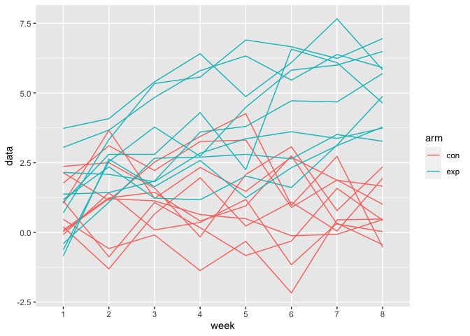

p8105\_hw5\_jak2312
================
Jared Klug

## Problem 1

Read and clean df

``` r
homicide_df = 
  read_csv("./data/homicide/homicide-data.csv") %>% 
  mutate(
    resolved = case_when(
      disposition == "Closed without arrest" ~ "unsolved",
      disposition == "Open/No arrest" ~ "unsolved",
      disposition == "Closed by arrest" ~ "solved"
    ),
    city_state = str_c(city, state, sep = "_")
  ) %>% 
  select(city_state, resolved) %>% 
  filter(city_state != "Tulsa_AL")
```

    ## Parsed with column specification:
    ## cols(
    ##   uid = col_character(),
    ##   reported_date = col_double(),
    ##   victim_last = col_character(),
    ##   victim_first = col_character(),
    ##   victim_race = col_character(),
    ##   victim_age = col_character(),
    ##   victim_sex = col_character(),
    ##   city = col_character(),
    ##   state = col_character(),
    ##   lat = col_double(),
    ##   lon = col_double(),
    ##   disposition = col_character()
    ## )

create aggregate df

``` r
aggregate_df = 
  homicide_df %>% 
    group_by(city_state) %>% 
    summarize(
      hom_total = n(),
      hom_unsolved = sum(resolved == "unsolved")
    ) 
```

    ## `summarise()` ungrouping output (override with `.groups` argument)

run prop test for 1 city

``` r
prop.test(
  aggregate_df %>% filter(city_state == "Baltimore_MD") %>% pull(hom_unsolved),
  aggregate_df %>% filter(city_state == "Baltimore_MD") %>% pull(hom_total)
) %>% broom::tidy()
```

    ## # A tibble: 1 x 8
    ##   estimate statistic  p.value parameter conf.low conf.high method    alternative
    ##      <dbl>     <dbl>    <dbl>     <int>    <dbl>     <dbl> <chr>     <chr>      
    ## 1    0.646      239. 6.46e-54         1    0.628     0.663 1-sample… two.sided

itterate over all the cities

``` r
results_df = 
  aggregate_df %>% 
    mutate(
      prop_test = map2(.x = hom_unsolved, .y = hom_total, ~prop.test(x = .x, n = .y)),
      tidy_test = map(prop_test, broom::tidy)
    ) %>% 
    select(-prop_test) %>% 
    unnest(tidy_test) %>% 
    select(city_state, estimate, conf.low, conf.high)
```

Arrange by estimate

``` r
results_df %>% 
  mutate(city_state = fct_reorder(city_state, estimate)) %>% 
  ggplot(aes(x = city_state, y = estimate)) +
  geom_point() +
  geom_errorbar(aes(ymin = conf.low, ymax = conf.high)) + 
  theme(axis.text.x = element_text(angle = 90, vjust = 0.5, hjust = 1))
```

<!-- -->

## Problem 2

``` r
study_data = tibble(
    filename = list.files("./data/longitudinal_study/"),
    subject_data = map(str_c("./data/longitudinal_study/", filename), read.csv)
  ) %>% 
  separate(filename, into = c("arm", "subject_id"), sep = "_") %>% 
  mutate(subject_id = str_replace(subject_id, ".csv", ""),
         subject_id = as.numeric(subject_id),
         subject_id = ifelse(str_detect(arm, "exp"), subject_id + 10, subject_id))
```

``` r
pat_data_long = function(df){
  df %>% pivot_longer(week_1:week_8,
                      names_to = "week",
                      names_prefix = "week_",
                      values_to = "data")
}

for(i in 1:20){
  study_data$subject_data[[i]] = pat_data_long(study_data$subject_data[[i]])
}

study_data
```

    ## # A tibble: 20 x 3
    ##    arm   subject_id subject_data    
    ##    <chr>      <dbl> <list>          
    ##  1 con            1 <tibble [8 × 2]>
    ##  2 con            2 <tibble [8 × 2]>
    ##  3 con            3 <tibble [8 × 2]>
    ##  4 con            4 <tibble [8 × 2]>
    ##  5 con            5 <tibble [8 × 2]>
    ##  6 con            6 <tibble [8 × 2]>
    ##  7 con            7 <tibble [8 × 2]>
    ##  8 con            8 <tibble [8 × 2]>
    ##  9 con            9 <tibble [8 × 2]>
    ## 10 con           10 <tibble [8 × 2]>
    ## 11 exp           11 <tibble [8 × 2]>
    ## 12 exp           12 <tibble [8 × 2]>
    ## 13 exp           13 <tibble [8 × 2]>
    ## 14 exp           14 <tibble [8 × 2]>
    ## 15 exp           15 <tibble [8 × 2]>
    ## 16 exp           16 <tibble [8 × 2]>
    ## 17 exp           17 <tibble [8 × 2]>
    ## 18 exp           18 <tibble [8 × 2]>
    ## 19 exp           19 <tibble [8 × 2]>
    ## 20 exp           20 <tibble [8 × 2]>

``` r
study_data$subject_data[[1]]
```

    ## # A tibble: 8 x 2
    ##   week   data
    ##   <chr> <dbl>
    ## 1 1      0.2 
    ## 2 2     -1.31
    ## 3 3      0.66
    ## 4 4      1.96
    ## 5 5      0.23
    ## 6 6      1.09
    ## 7 7      0.05
    ## 8 8      1.94

``` r
study_data %>% 
  unnest(subject_data) %>% 
  ggplot(aes(x = week, y = data, group = subject_id)) +
  geom_line(aes(color = arm))
```

<!-- -->

We can see that subjects in both the experimental arm and control arm
have points that fluctuate throughout the 8 weeks. However, we can
observe a general upwards trend in the experimental arm which can
indicate that the treatment these subjects are getting is influencing
the data. The control arm data fluctuates heavily but there does not
appear to be an overall change in the output reading.

## Problem 3

``` r
normal_dist = function(n = 30, mu, sigma = 5){
  sim_data = tibble(
    x = rnorm(n, mean = mu, sd = sigma)
    )
  
  sim_data %>% 
    summarize(
      mu_hat = mean(x),
      p_value = t.test(x, mu = mu) %>% broom::tidy() %>% select(p.value)
    ) %>% 
    mutate(power = ifelse(p_value$p.value < 0.05, 1, 0))
}

set.seed(1000)

results = 
  tibble(true_mu = c(0,1,2,3,4,5,6)) %>% 
  mutate(
    output_list = map(.x = true_mu, ~rerun(5000, normal_dist(mu = .x))),
    sim_results = map(output_list, bind_rows)
  ) %>% 
  select(-output_list) %>% 
  unnest(sim_results)
```
